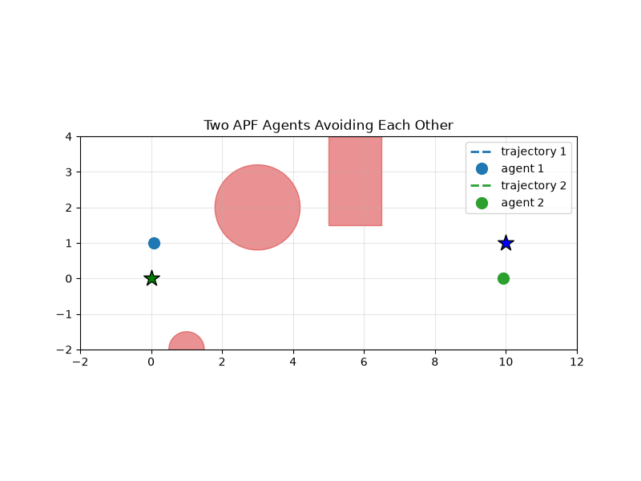
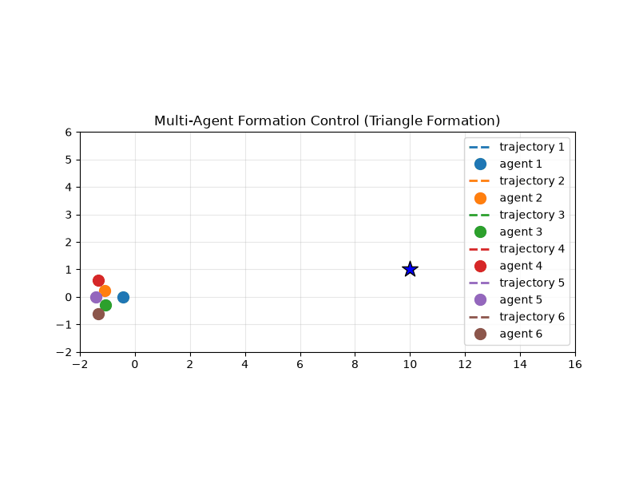
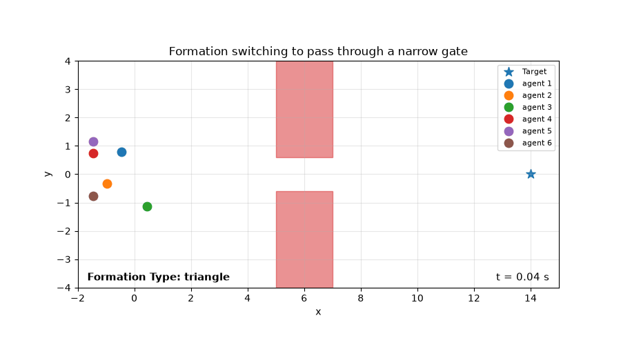
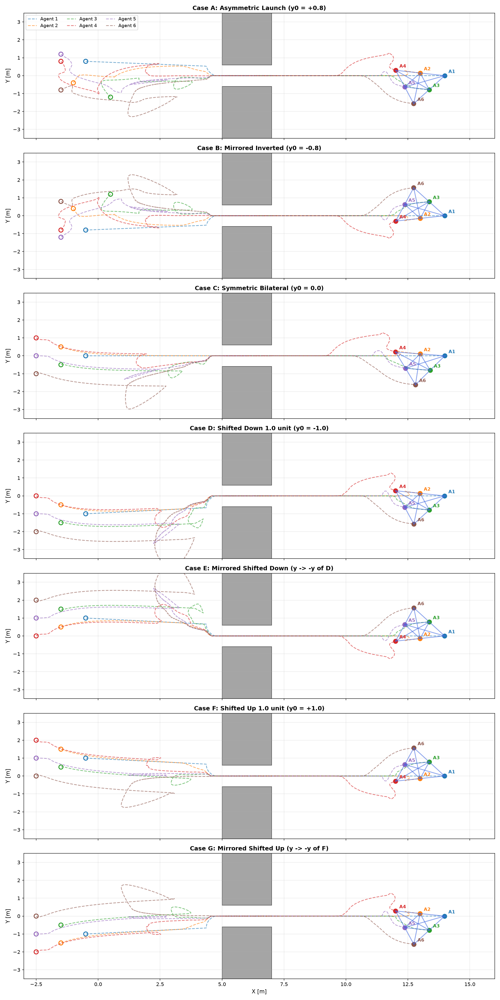

# Formation Control and APF Obstacle Avoidance

A modular Python framework for **Multi-Agent Formation Control** combined with **Artificial Potential Fields (APF)** for real-time obstacle avoidance and dynamic formation switching in constrained environments.

---

## Key Features

- **Negative Gradient APF Formulation:** Repulsive forces are derived analytically from the negative gradient of safe-distance distance potentials $-\nabla J_{\text{rep}}(\mathbf{q})$ using the chain rule.
- **Distance-Based Rigidity Control:** Directed mutual distance constraints keep rigid 2D geometric patterns (e.g., regular triangle meshes) without global coordinate broadcasting.
- **Dynamic Topology Switching:** Real-time geometric probes anticipate upcoming narrow corridors/doors and trigger decentralized transitions from 2D formations to a 1D single-file column (and vice versa).
- **Transient & Symmetry Analysis:** Systematic benchmark analyzing reflection equivariance, saddle-point bifurcations, and initial condition chirality in distance-only rigidity graphs.

---

## 1. Multi-Agent Obstacle & Inter-Agent Collision Avoidance

Obstacles and neighbouring agents generate repulsive potential fields $J_{\text{rep}}(\mathbf{q})$ when entering an influence region $\delta_0$:

$$J_{\text{rep}}(\mathbf{q}) = \frac{1}{\beta} \left( \frac{1}{d(\mathbf{q}) - \delta} - \frac{1}{\delta_0 - \delta} \right)^\beta$$

$$\mathbf{F}_{\text{rep}}(\mathbf{q}) = -\nabla J_{\text{rep}}(\mathbf{q}) = \frac{1}{(d(\mathbf{q}) - \delta)^2} \left( \frac{1}{d(\mathbf{q}) - \delta} - \frac{1}{\delta_0 - \delta} \right)^{\beta - 1} \hat{\mathbf{n}}$$

where $\hat{\mathbf{n}} = \frac{\mathbf{q} - \mathbf{c}^\star}{\Vert \mathbf{q} - \mathbf{c}^\star \Vert}$ is the unit normal pointing away from the closest Euclidean projection $\mathbf{c}^\star$ on the obstacle surface, and $\delta$ is the minimum safe clearance distance.



---

## 2. Rigid Formation Control

Formation control is achieved through mutual distance constraints over a directed acyclic graph (DAG). For each constraint between parent $i$ and child $j$ with desired distance $d_{ij}$:

$$\mathbf{u}_{j,\text{form}} = -k (\|\mathbf{p}_i - \mathbf{p}_j\|^2 - d_{ij}^2)(\mathbf{p}_j - \mathbf{p}_i)$$



---

## 3. Dynamic Formation Switching in Narrow Bottlenecks

When navigating through narrow passages (e.g. gates, doors), a forward virtual probe detects lateral clearance constraints and coordinates a smooth state transition:

$$\text{Triangle Formation (2D)} \underset{\text{Gap Detected}}{\overset{\text{Traveled Distance}}{\rightleftharpoons}} \text{Line Formation (1D)}$$



---

## 4. Initial Condition Chirality & Reflection Symmetry

Distance-based potential energy surfaces possess symmetric, isometric local minima (**flipped embeddings**). The final geometric orientation (upward vs downward tilt) is governed by the **basin of attraction** of the launch trajectory:

- **Case A ($y_0 = +0.8$):** Fleet enters with a downward angle and converges to an upward-tilted triangle ($y \in [0, +1.73]$).
- **Case B ($y_0 = -0.8$, $y \to -y$):** Inverting initial coordinates mirrors the final formation across $y=0$ ($y \in [0, -1.73]$).
- **Case C ($y_0 = 0.0$):** Symmetric launch collapses onto the $y=0$ saddle point inside the bottleneck, where numerical noise breaks symmetry.



---

## Project Structure

```
.
├── assets/
│   ├── two_agents_apf.gif                  # Two-agent APF collision avoidance
│   ├── triangle_formation.gif              # Multi-agent triangle navigation
│   ├── formation_switching.gif             # Dynamic corridor passage
│   └── formation_symmetry_comparison.png   # 3x1 comparative benchmark
├── main.ipynb                              # Interactive Jupyter Notebook
├── README.md                               # Project documentation
└── .gitignore                              # Git tracking configuration
```

---

## Getting Started

### Prerequisites
- Python 3.9+
- `numpy`, `matplotlib`, `shapely`, `pillow`

### Installation & Execution
```bash
# Clone the repository
git clone https://github.com/fsciamma/Formation-Control-and-APF-Obstacle-Avoidance.git
cd Formation-Control-and-APF-Obstacle-Avoidance

# Run the Jupyter Notebook
jupyter notebook main.ipynb
```
